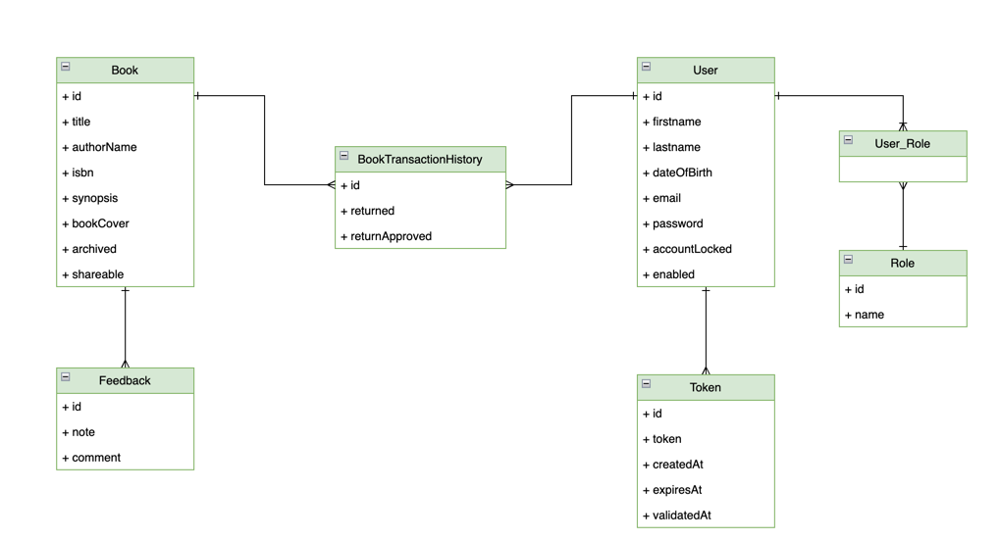

# BookMate Application

## Overview

It is a full-stack application. That helps the user to manage book collections and engage with other book-loving users. 
Features:
Users can register for accounts with secure email validation and log in safely. They can manage their books—creating, updating, sharing, or archiving them. The system handles book borrowing, ensuring eligibility, and facilitates returns, which require approval for completion.

## Features

- Designed and implemented a class diagram based on business requirements using a mono repo approach. 
- Secured the application with JWT tokens, managed user registration, and validated accounts via email. 
- Implemented the service layer, handled exceptions, and validated objects using Spring Validation. 
- Documented APIs with OpenAPI and Swagger UI, Dockerized the infrastructure, and set up a CI/CD pipeline for deployment.

#### Class diagram

#### Spring security diagram

## Technologies Used

### Backend

- Spring Boot 3
- Spring Security 6
- JWT Token Authentication
- Spring Data JPA
- JSR-303 and Spring Validation
- OpenAPI and Swagger UI Documentation
- Docker
- GitHub Actions
- Keycloak

### Frontend

- Angular
- Component-Based Architecture
- Lazy Loading
- Authentication Guard
- OpenAPI Generator for Angular
- Bootstrap

